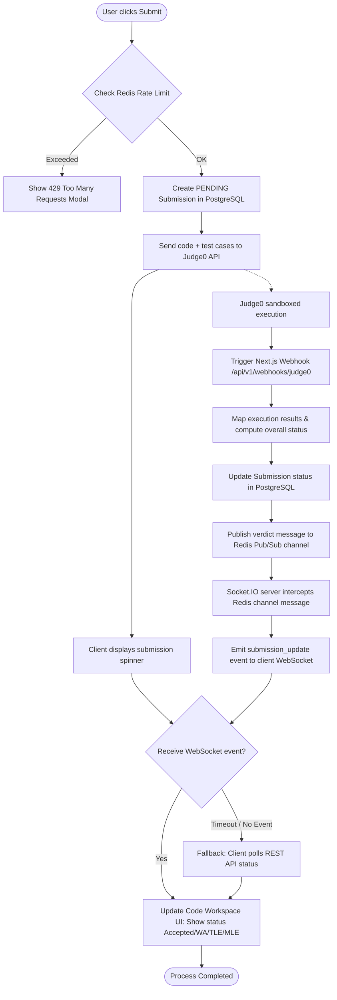
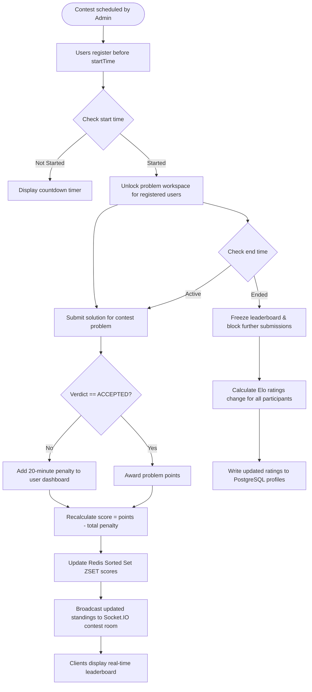
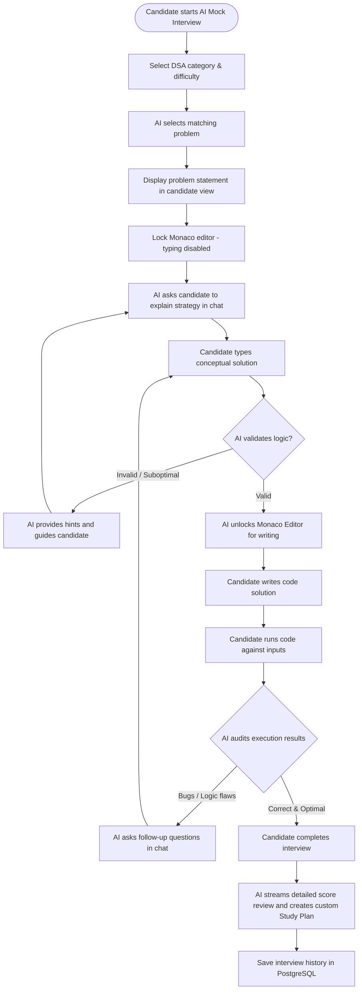
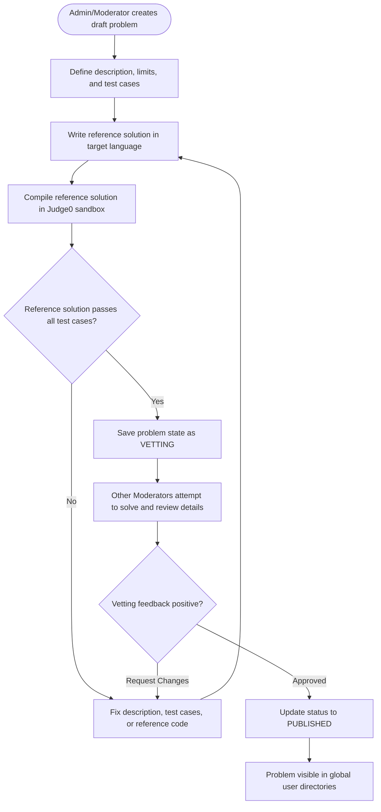

# Activity Diagrams & Workflows - LogiQuest

This document details the functional workflows of the **LogiQuest** platform. Each diagram outlines the interaction sequence, logical conditions, and data transactions between users, system services, database engines, and third-party APIs.

---

## 1. Code Execution & Submission Lifecycle

This workflow tracks the process of running and submitting code, showcasing how stateless Next.js routes, background Judge0 containers, Redis Pub/Sub, and Socket.IO servers coordinate to update the client workspace.

---

## 2. Contest Arena Scheduling & Leaderboard Scoring

This workflow models the lifecycle of user registrations, score penalty adjustments during active solving phases, Redis Sorted Set leaderboard calculations, and post-contest Elo rating updates.

---

## 3. AI Mock Interview Simulator

This workflow maps the multi-stage interactive mock interview, showing how the candidate's strategic strategy discussion acts as a gate to unlock the code editing board.

---

## 4. Architect & Vetting Pipeline

This workflow details the validation lifecycle required to compile and verify problems before moderators approve them for public access.

