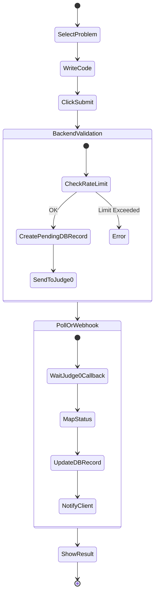

# Activity Diagrams

## User Code Submission Activity

```mermaid
stateDiagram-v2
    [*] --> SelectProblem
    SelectProblem --> WriteCode
    WriteCode --> ClickSubmit
    ClickSubmit --> BackendValidation
    
    state BackendValidation {
        [*] --> CheckRateLimit
        CheckRateLimit --> CreatePendingDBRecord: OK
        CheckRateLimit --> Error: Limit Exceeded
        CreatePendingDBRecord --> SendToJudge0
    }
    
    BackendValidation --> PollOrWebhook
    
    state PollOrWebhook {
        [*] --> WaitJudge0Callback
        WaitJudge0Callback --> MapStatus
        MapStatus --> UpdateDBRecord
        UpdateDBRecord --> NotifyClient
    }
    
    PollOrWebhook --> ShowResult
    ShowResult --> [*]
```
