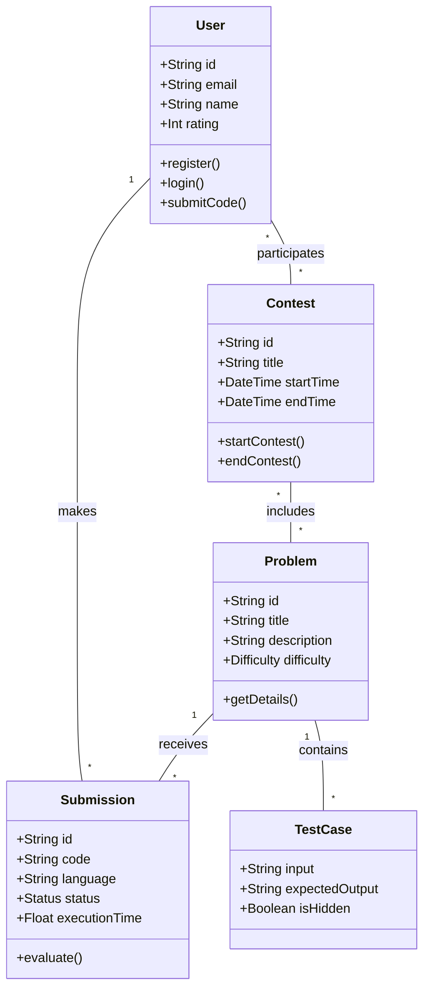

# Class Diagrams

## Core Entities

```mermaid
classDiagram
    class User {
        +String id
        +String email
        +String name
        +Int rating
        +register()
        +login()
        +submitCode()
    }
    
    class Problem {
        +String id
        +String title
        +String description
        +Difficulty difficulty
        +getDetails()
    }
    
    class Submission {
        +String id
        +String code
        +String language
        +Status status
        +Float executionTime
        +evaluate()
    }
    
    class TestCase {
        +String input
        +String expectedOutput
        +Boolean isHidden
    }
    
    class Contest {
        +String id
        +String title
        +DateTime startTime
        +DateTime endTime
        +startContest()
        +endContest()
    }

    User "1" -- "*" Submission : makes
    Problem "1" -- "*" Submission : receives
    Problem "1" -- "*" TestCase : contains
    Contest "*" -- "*" Problem : includes
    User "*" -- "*" Contest : participates
```
