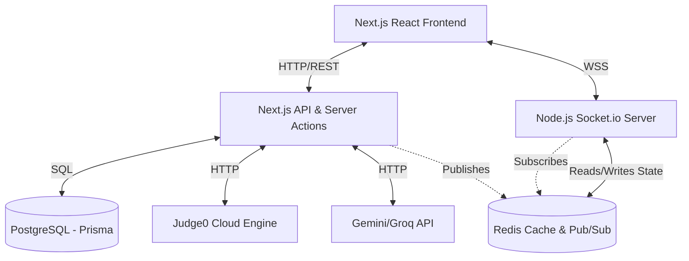

# Component Diagram

```mermaid
graph TD
    UI[Next.js React Frontend]
    API[Next.js API & Server Actions]
    Socket[Node.js Socket.io Server]
    DB[(PostgreSQL - Prisma)]
    Cache[(Redis Cache & Pub/Sub)]
    Judge[Judge0 Cloud Engine]
    LLM[Gemini/Groq API]

    UI <-->|HTTP/REST| API
    UI <-->|WSS| Socket
    
    API <-->|SQL| DB
    API <-->|HTTP| Judge
    API <-->|HTTP| LLM
    API -.->|Publishes| Cache
    
    Socket -.->|Subscribes| Cache
    Socket <-->|Reads/Writes State| Cache
```
