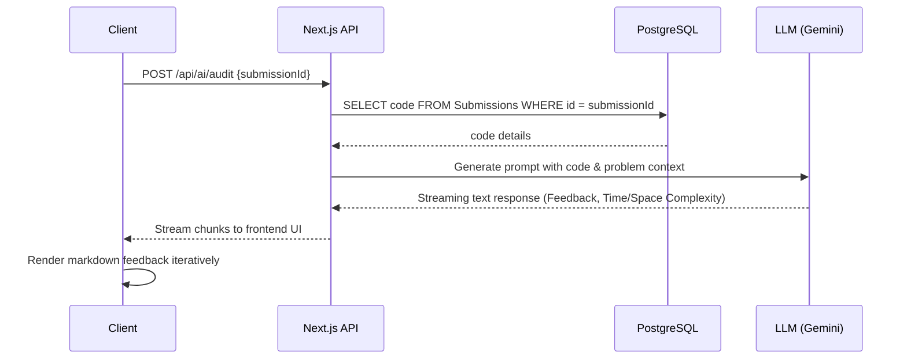

# Sequence Diagrams

## AI Code Audit Sequence

```mermaid
sequenceDiagram
    participant C as Client
    participant A as Next.js API
    participant D as PostgreSQL
    participant L as LLM (Gemini)

    C->>A: POST /api/ai/audit {submissionId}
    A->>D: SELECT code FROM Submissions WHERE id = submissionId
    D-->>A: code details
    A->>L: Generate prompt with code & problem context
    L-->>A: Streaming text response (Feedback, Time/Space Complexity)
    A-->>C: Stream chunks to frontend UI
    C->>C: Render markdown feedback iteratively
```
