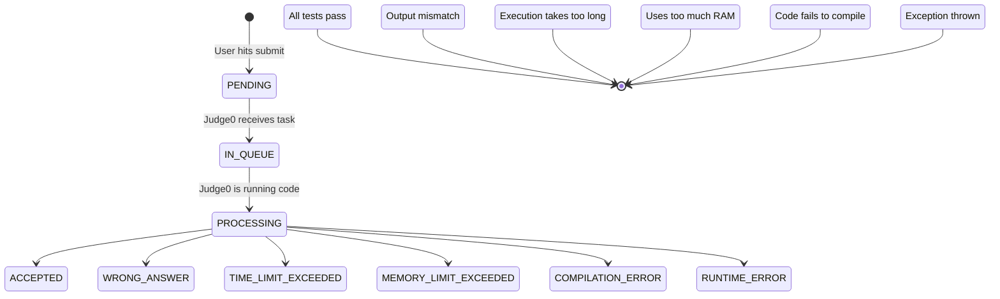

# Submission State Diagram

```mermaid
stateDiagram-v2
    [*] --> PENDING: User hits submit
    PENDING --> IN_QUEUE: Judge0 receives task
    IN_QUEUE --> PROCESSING: Judge0 is running code
    
    PROCESSING --> ACCEPTED (AC): All tests pass
    PROCESSING --> WRONG_ANSWER (WA): Output mismatch
    PROCESSING --> TIME_LIMIT_EXCEEDED (TLE): Execution takes too long
    PROCESSING --> MEMORY_LIMIT_EXCEEDED (MLE): Uses too much RAM
    PROCESSING --> COMPILATION_ERROR (CE): Code fails to compile
    PROCESSING --> RUNTIME_ERROR (RE): Exception thrown
    
    ACCEPTED (AC) --> [*]
    WRONG_ANSWER (WA) --> [*]
    TIME_LIMIT_EXCEEDED (TLE) --> [*]
    MEMORY_LIMIT_EXCEEDED (MLE) --> [*]
    COMPILATION_ERROR (CE) --> [*]
    RUNTIME_ERROR (RE) --> [*]
```
