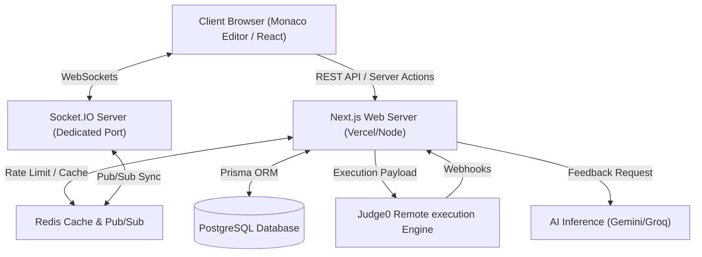

# Project Overview & Architecture - LogiQuest

## 1. Executive Summary

LogiQuest is a next-generation interactive learning and interview platform. It utilizes a microservices-inspired hybrid monolith architecture built with Next.js, custom Socket.IO real-time servers, PostgreSQL database with Prisma, and Redis caching. It features high-speed compiling and running of untrusted user code via Judge0 sandboxed environments and streams AI-driven audits and analysis using Google Gemini and Groq models.

---

## 2. Technical Stack

### 2.1 Core Frameworks & Languages
*   **Language:** TypeScript (Fully typed interfaces across server, editor, and database layers).
*   **Frontend Framework:** Next.js 16 (App Router) with React 19.
*   **Styling & UI:** Tailwind CSS 4 with custom PostCSS plugins and Framer Motion for rich animations.
*   **Stateful Services:** Node.js Socket.IO server (`server.js`) for real-time contests and chat.

### 2.2 Data & Caching
*   **Primary Database:** PostgreSQL (ACID-compliant storage of users, submissions, contests).
*   **ORM Layer:** Prisma ORM (v5.22.0) managing type safety and schema migrations.
*   **In-Memory Store:** Redis (Upstash/ioredis) for user sessions, rate limiting, and pub/sub message communication between the WebSocket and API servers.

### 2.3 Executions & AI Core
*   **Execution Sandbox:** Judge0 Cloud Engine (API integration supporting JS, Python, C++, Java, and SQL).
*   **Inference Engines:** Google Generative AI (Gemini Pro/Flash SDK) and Groq SDK (Llama-3.3-70b).

---

## 3. Architecture & Topology

LogiQuest splits workloads into stateless (Next.js) and stateful (Socket.IO) domains to ensure optimal scalability.

---

## 4. Feature Domain Breakdowns

The codebase is organized into modular features under `src/features/` to maintain clean separation of concerns:

### 4.1 AI Coach (`src/features/ai`)
*   Manages system prompt layouts, streaming feedback engines, and conversation threads for mock interviews.
*   Interacts with Gemini and Groq APIs to perform static code analysis and compute complexity structures.

### 4.2 Arena (`src/features/arena`)
*   Handles live contest rooms, timer tick updates, real-time leaderboard calculations, and contest registry.
*   Synchronizes live metrics across WebSocket rooms using Redis caching for rapid standings updates.

### 4.3 Architect (`src/features/architect`)
*   Provides admin tools to create, modify, and publish coding, SQL, and system design problems.
*   Handles test suite validation and verification flow (Stable, Unstable, Vetting).

### 4.4 Visualizer (`src/features/visualizer`)
*   Interactive UI engines that allow users to visually trace execution steps of data structures (e.g., [LinkedListVisualizer](file:///D:/LEETCLONE/src/features/visualizer/LinkedListVisualizer.tsx)).

---

## 5. End-to-End Execution Flow (Submission Lifecycle)

1.  **Code Submission**: The user clicks "Submit" in the coding workspace. The code, target language, and problem metadata are sent to the Next.js API endpoint `POST /api/v1/submissions`.
2.  **Request Queueing**: Next.js logs the submission to PostgreSQL with status `PENDING` and passes the code to the **Judge0 Execution Sandbox** with a return webhook endpoint.
3.  **Sandboxed Evaluation**: Judge0 executes the code inside a secure sandbox container against standard and hidden input cases.
4.  **Webhook Trigger**: Once evaluation completes, Judge0 triggers a POST webhook back to Next.js (`POST /api/v1/webhooks/judge0`).
5.  **Data Processing & Pub/Sub**: Next.js updates the submission row in PostgreSQL (`ACCEPTED`, `WRONG_ANSWER`, etc.) and publishes the result to Redis Pub/Sub.
6.  **Socket Synchronization**: The stateful Socket.IO server catches the Redis Pub/Sub event and pushes a `submission_update` event to the user's browser, updating the coding workspace immediately.
