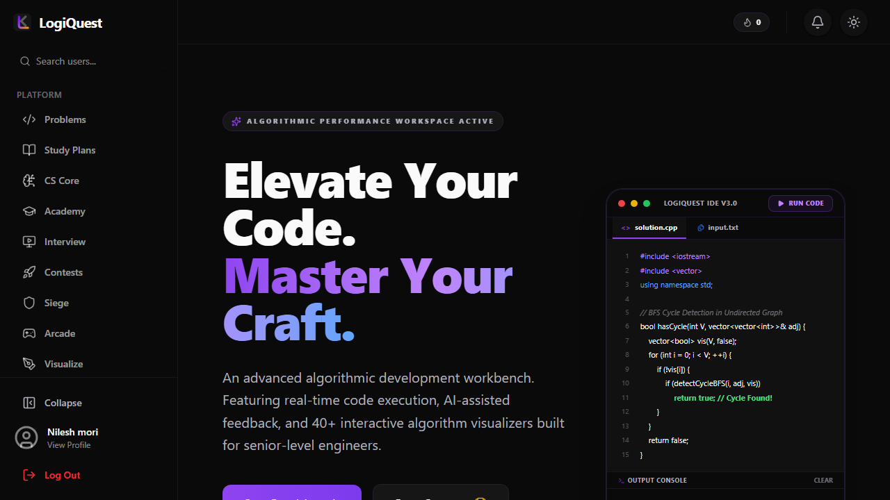
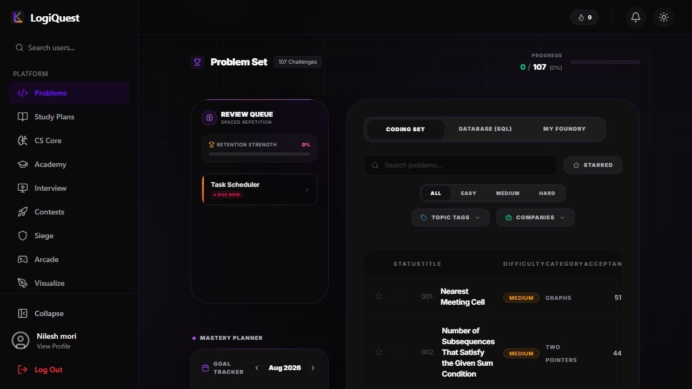
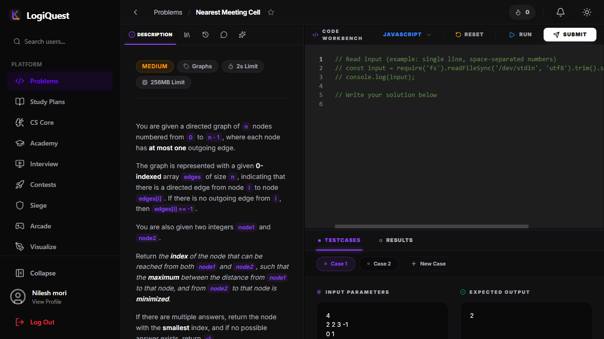
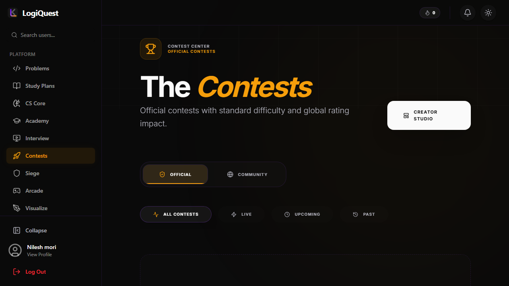
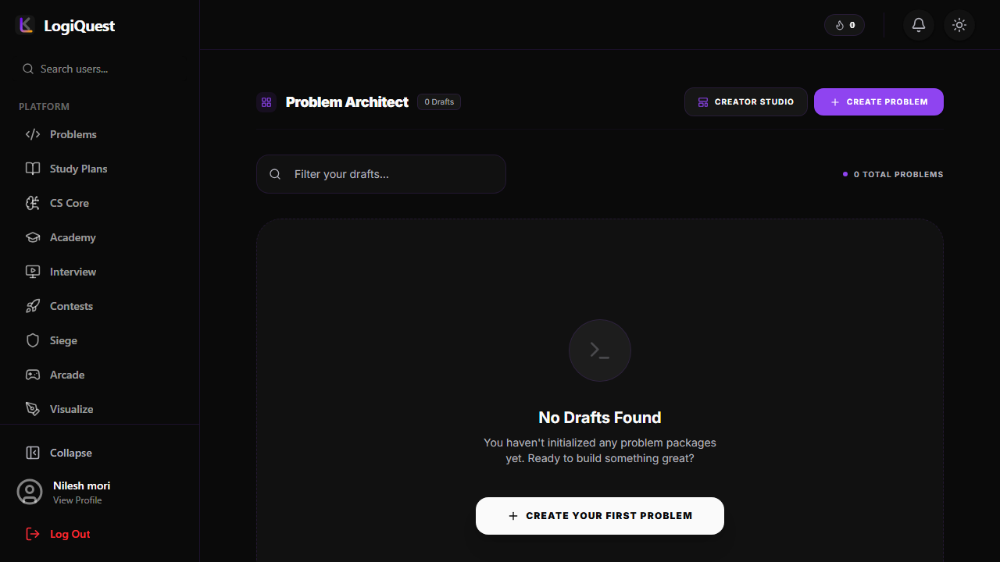
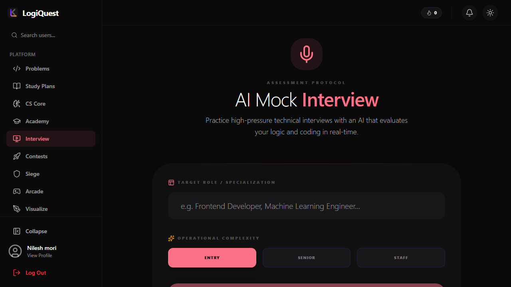

<div align="center">


# LogiQuest

### Code. Compete. Conquer.

[](https://nextjs.org/)
[](https://react.dev/)
[](https://www.typescriptlang.org/)
[](https://www.postgresql.org/)
[](https://redis.io/)
[](https://socket.io/)
[](https://tailwindcss.com/)
[](https://judge0.com/)
[](https://ai.google.dev/)

---

**A full-stack, real-time algorithmic playground and competitive programming platform that brings the thrill of coding directly to your browser.**

[Live Demo](https://logiquest.nileshmori.me) • [API Docs](#api-documentation) • [Getting Started](#getting-started) • [Architecture](#system-architecture)

</div>

---

## 🎯 The Problem We Solve

In the modern tech landscape, software engineers and computer science students face an overwhelming array of resources to prepare for technical interviews. Jumping between a compiler, a whiteboard, a system design canvas, and an AI chatbot creates immense friction.

Furthermore, traditional competitive programming platforms often suffer from outdated user interfaces, rigid constraints, and a lack of collaborative, real-time engagement. 

**LogiQuest bridges this gap.** It operates as a modern, unified hub for developers. Users can write code in a VS-Code equivalent editor, execute it securely in the cloud across 5+ languages, compete in live multiplayer arenas with real-time leaderboards, visualize complex graphs, and receive instant AI-powered code audits—all within a single, beautifully designed application.

> This is not just a clone. LogiQuest is a fully functional, production-grade platform featuring real-time WebSockets, distributed background queues, advanced Abstract Syntax Tree (AST) checking, and multi-model AI agents built entirely from the ground up.

---

## 📸 Platform Features & Walkthrough

<table>

<tr>
<td width="35%" align="center">
  
</td>
<td width="65%">
  <h3>1. Interactive Developer Dashboard</h3>
  <p>The central hub for every user. It provides a real-time snapshot of the user's progress, upcoming contests, and personal statistics.</p>
  <ul>
    <li><b>Radar Analytics:</b> Uses <code>Recharts</code> to visually map a user's proficiency across Arrays, DP, Graphs, and Trees.</li>
    <li><b>Activity Heatmap:</b> GitHub-style contribution graphs mapping submission streaks and consistency.</li>
    <li><b>Live Feed:</b> WebSocket-powered notifications for new followers, contest results, and trending community posts.</li>
  </ul>
</td>
</tr>

<tr>
<td width="35%" align="center">
  
</td>
<td width="65%">
  <h3>2. Advanced Problem Explorer</h3>
  <p>A high-performance repository of curated coding challenges ranging from basic arrays to complex system designs.</p>
  <ul>
    <li><b>Multi-Faceted Search:</b> Filter by difficulty, pattern, tags, or company-specific lists using optimistic UI updates via React 19.</li>
    <li><b>Dynamic Visuals:</b> Problems feature interactive SVG diagrams in their descriptions that respond to the user's system theme (Light/Dark mode).</li>
    <li><b>Status Tracking:</b> Instantly see which problems are solved, attempted, or part of an active study plan.</li>
  </ul>
</td>
</tr>

<tr>
<td width="35%" align="center">
  
</td>
<td width="65%">
  <h3>3. The Monaco Execution Workspace</h3>
  <p>The beating heart of LogiQuest. A split-pane code editor that feels exactly like a local IDE.</p>
  <ul>
    <li><b>Pro-Level Editing:</b> Multi-cursor support, minimap, syntax highlighting, and Vim bindings powered by <code>@monaco-editor/react</code>.</li>
    <li><b>Cloud Execution:</b> Submit code to the Judge0 sandbox architecture with strict Memory limits (MB) and Time constraints (ms).</li>
    <li><b>Custom Test Cases:</b> Define manual test matrices or run against up to 100 hidden performance test cases seamlessly in the background.</li>
  </ul>
</td>
</tr>

<tr>
<td width="35%" align="center">
  
</td>
<td width="65%">
  <h3>4. Real-Time Arena & Contests</h3>
  <p>Multiplayer competitive programming where every millisecond counts, powered entirely by Socket.IO.</p>
  <ul>
    <li><b>Live Leaderboards:</b> The frontend instantly recalculates rankings, delta scores, and penalties across all active participants using Redis Pub/Sub.</li>
    <li><b>Tactical Scoring:</b> Incorporates ICPC-style penalty tracking for wrong submissions, preventing brute-force guessing.</li>
    <li><b>Anti-Cheat Mechanisms:</b> Prevents tab switching and utilizes AST comparisons to detect hardcoded outputs during active contests.</li>
  </ul>
</td>
</tr>

<tr>
<td width="35%" align="center">
  
</td>
<td width="65%">
  <h3>5. Problem Architect Mode</h3>
  <p>A specialized suite for instructors and community moderators to build and vet new algorithms.</p>
  <ul>
    <li><b>Test Case Generator:</b> Write seeding scripts to auto-generate edge cases, large inputs, and strict output boundaries.</li>
    <li><b>Vetting Pipeline:</b> New problems are isolated in an "Unstable" queue where reference solutions (C++, Java, Python) must execute successfully before the problem is published.</li>
  </ul>
</td>
</tr>

<tr>
<td width="35%" align="center">
  
</td>
<td width="65%">
  <h3>6. AI Mock Interviews & Audits</h3>
  <p>Integrated Large Language Models that act as a personal coach and technical interviewer.</p>
  <ul>
    <li><b>Instant Code Audits:</b> Upon a successful AC submission, a background job uses Google Gemini to audit the code's Big-O Time & Space complexity.</li>
    <li><b>Conversational Scenarios:</b> Simulates FAANG-style interview loops where the AI asks follow-up constraint questions and grades system design answers.</li>
  </ul>
</td>
</tr>

</table>

---

## ⚙️ System Architecture

LogiQuest's architecture is distributed, modular, and optimized for high-throughput code execution and real-time multiplayer synchronization.

```mermaid
graph TD
    %% Define Styles
    classDef clientStyle fill:#3b82f6,stroke:#1d4ed8,stroke-width:2px,color:#fff;
    classDef apiStyle fill:#10b981,stroke:#047857,stroke-width:2px,color:#fff;
    classDef dbStyle fill:#f59e0b,stroke:#b45309,stroke-width:2px,color:#fff;
    classDef extStyle fill:#8b5cf6,stroke:#5b21b6,stroke-width:2px,color:#fff;
    
    %% Nodes
    Client[Web Client<br/>Next.js 15]:::clientStyle
    API[Next.js API & Server Actions]:::apiStyle
    SocketServer[Custom Socket.io Server]:::apiStyle
    
    Postgres[(PostgreSQL via Prisma)]:::dbStyle
    Redis[(Redis Cache & Queue)]:::dbStyle
    
    Judge0[Judge0 Sandbox Execution]:::extStyle
    AI[Gemini / OpenAI LLM Fleet]:::extStyle

    %% Relationships
    Client -->|REST / Server Actions| API
    Client <-->|WebSockets (ws://)| SocketServer
    
    API -->|Read / Write| Postgres
    API -->|Queue Jobs / Cache| Redis
    SocketServer -->|Pub / Sub State| Redis
    
    API -->|Submit Payload| Judge0
    API -->|Prompt Injection| AI
```

---

## 🔄 Execution Lifecycle

Every code submission in LogiQuest follows a carefully designed state machine to ensure security, accuracy, and performance under load:

| Phase | Flow | Key Mechanism |
| :--- | :--- | :--- |
| **Submission** | Client > Next.js API > Redis Queue | Request is validated using Zod, sanitized, and queued via BullMQ to prevent API bottlenecks. |
| **Execution** | Redis Queue > Worker > Judge0 | Worker batches test cases (up to 100) and streams them to the Judge0 sandbox containers. |
| **Evaluation** | Judge0 > Worker > Normalization | Output is heavily validated against expected outcomes, handling trailing spaces, floating point precision, and TLEs. |
| **Persistence** | Worker > PostgreSQL > AI Audit | The result (AC, WA, TLE, RE) is saved. If Accepted, an async AI job audits the code for Space/Time complexity. |

---

## 🛠️ Technology Stack -- Deep Dive

### Frontend

| Technology | Version | Role in LogiQuest |
| :--- | :--- | :--- |
| **Next.js** | 15.1 | App Router-based framework providing hybrid SSR/CSR. Delivers lightning-fast initial paints and SEO-friendly problem pages. |
| **React** | 19.2 | Component architecture utilizing the latest Hooks and Actions paradigm. |
| **TailwindCSS** | 4.0 | Utility-first CSS powering a massive bespoke design system (dark modes, glassmorphism, fluid typography). |
| **Monaco Editor** | 0.53 | The core code editing experience. Hooks directly into the DOM to provide syntax highlighting, IntelliSense, and multi-cursor capabilities. |
| **Framer Motion** | 12.23 | Orchestrates complex micro-interactions, modal popovers, and smooth route transitions. |
| **Socket.IO Client** | 4.8 | Maintains a persistent duplex connection for live arena leaderboards and peer-to-peer chat. |
| **Recharts** | 3.5 | Renders complex SVG-based analytics dashboards for user profiles (e.g., radar charts for skills). |
| **Tiptap** | 3.13 | A headless wrapper around ProseMirror providing a rich, notion-style text editor for the discussion forums. |

### Backend

| Technology | Version | Role in LogiQuest |
| :--- | :--- | :--- |
| **Node.js** | 22+ | Execution environment for the custom WebSocket server and serverless backend routes. |
| **TypeScript** | 5.x | Enforces strict, end-to-end type safety bridging the database schema, API contracts, and frontend props. |
| **PostgreSQL** | 16 | Primary relational datastore holding over 30 deeply relational tables. |
| **Prisma ORM** | 5.22 | Type-safe database client handling complex aggregations, transactions, and automated migrations. |
| **Redis** | 7.x | High-throughput in-memory datastore acting as the BullMQ broker and Socket.io state adapter. |
| **Judge0** | v1.13 | Isolated, Docker-based code execution engine supporting multiple languages with strict CPU and Memory boundaries. |
| **BullMQ** | 5.76 | Distributed background job queue. Handles code submission scaling and async AI audits without blocking the main event loop. |
| **Google Gemini** | 0.24 | AI reasoning engine utilizing `gemini-1.5-pro` for deep code analysis and `gemini-1.5-flash` for rapid hints. |
| **Next-Auth** | v5 (Beta) | Zero-trust authentication layer handling Credentials, Google OAuth, and secure HTTP-only session cookies. |

---

## 📂 Project Structure

```text
logiquest/
|
|-- prisma/                       # Database schema and seed files
|   |-- schema.prisma             # The source of truth for the 30+ tables
|
|-- src/
|   |-- app/                      # Next.js App Router (Pages, Layouts, API Routes)
|   |   |-- api/                  # Backend REST / RPC endpoints
|   |   |   |-- submission/       # Async execution route handlers
|   |
|   |-- components/               # Global UI library (Buttons, Modals, Navbars)
|   |
|   |-- features/                 # Domain-Driven Design Modules
|   |   |-- arena/                # Contest logic, realtime leaderboards
|   |   |-- architect/            # Problem creation & AST validation
|   |   |-- ai/                   # AI Chatbot & Mock Interview interface
|   |   |-- visualizer/           # Interactive Algorithm visualizations (SVG/Canvas)
|   |   |-- problems/             # Workspace, Monaco Editor, Test Case panes
|   |
|   |-- lib/                      # Core Backend Services
|   |   |-- codeExecution.ts      # Judge0 interface & polling logic
|   |   |-- worker.ts             # BullMQ consumer for async tasks
|   |   |-- gemini.ts             # AI prompt engineering & inference
|   |   |-- prisma.ts             # Global ORM singleton
|
|-- public/                       # Static assets, SVGs, and audio files
|-- server.js                     # Custom Express/Socket.IO server
|-- tailwind.config.mjs           # Centralized design tokens
|-- docker-compose.yml            # Local infrastructure orchestration
```

---

## 🚦 Getting Started

### Prerequisites

| Requirement | Minimum Version |
| :--- | :--- |
| Node.js | 22.x |
| npm | 10.x |
| PostgreSQL | 16.x (local or cloud) |
| Redis | 7.x (local or cloud) |
| Docker | Latest (Optional, for easy infra) |

### Local Setup

```bash
# 1. Clone the repository
git clone https://github.com/nileshmori/logiquest.git
cd logiquest

# 2. Configure environment variables
cp .env.example .env

# 3. Start local Postgres and Redis via Docker (Optional)
docker-compose up -d

# 4. Install dependencies
npm install

# 5. Bootstrap the database
npx prisma generate
npx prisma migrate dev
npx prisma db seed

# 6. Start the environment
# Terminal 1: Starts Next.js Server
npm run dev

# Terminal 2: Starts WebSocket Server
npm run socket
```

---

## 🛡️ Security

| Layer | Implementation |
| :--- | :--- |
| **Authentication** | JWT access via HTTP-only secure cookies encrypted via Next-Auth v5. |
| **Sandbox Execution** | Untrusted user code is executed in strictly isolated, unprivileged Docker containers (Judge0). |
| **System Constraints** | Code execution is hardware-capped with absolute CPU `timeLimits` and `memoryLimits`. |
| **Input Validation** | All client payloads are sanitized and strictly typed via `Zod` before reaching controllers. |
| **Rate Limiting** | Custom middleware utilizing Redis to throttle execution spam and DDOS vectors. |

---

## 📜 License

This project is proprietary software. Unauthorized distribution, reproduction, or commercial use without explicit permission is strictly prohibited.

---

<div align="center">

**Built with conviction that developer tools should be beautiful, fast, and completely unified.**

[](#)
[](#)
[](#)
[](#)
[](#)

</div>
