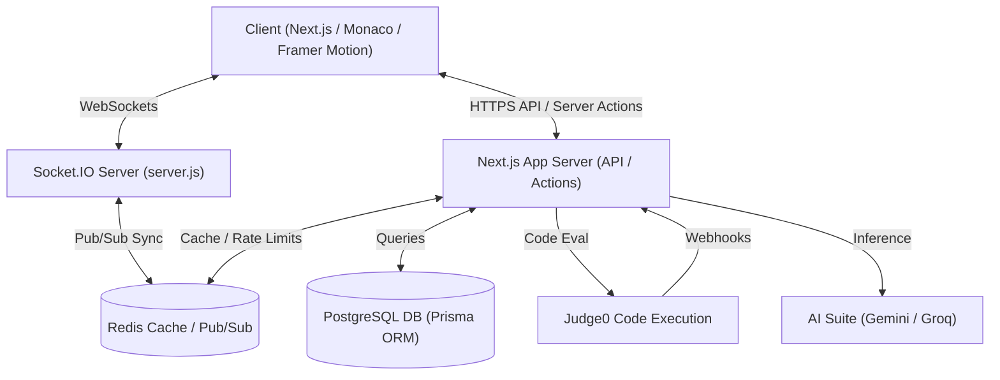

# LogiQuest - Solve Logic, Master the Journey

[](https://deepwiki.com/nilesh7757/LEETCLONE)

LogiQuest is a premium, high-fidelity full-stack platform designed to provide a robust environment for competitive programming, technical interview preparation, and coding practice. It integrates cutting-edge frontend animations, an interactive data structure visualizer, real-time contest dashboards, secure background code execution, and multi-model AI agents to offer an unmatched, state-of-the-art developer learning experience.

---

## 📖 Complete Documentation Suite

LogiQuest is designed with a professional development lifecycle in mind. Explore our detailed documentation modules categorized below:

### 📋 Requirements & Specifications
*   **[Vision Document](Documents/vision_document.md):** High-level product goals, user personas, problem statement, and scope.
*   **[Functional Requirements](Documents/Functional_Requirements.md):** Comprehensive breakdown of functional modules (Problem Workspace, Arena, AI Mock Interview).
*   **[Non-Functional Requirements](Documents/Non-Functional_Requirements.md):** Detailed performance benchmarks, security mandates, reliability, and accessibility parameters.
*   **[Stakeholder Analysis](Documents/stakeholder_analysis.md):** Analysis of primary users, contributors, administrators, and third-party dependencies.
*   **[Use Cases](Documents/Use_cases.md):** Sequence of events and actor-system interaction pathways.
*   **[User Stories](Documents/User_Stories.md):** User-centric feature definitions written in standard Agile format with clear acceptance criteria.

### 🏗️ Architecture & Technical Design
*   **[High-Level Design (HLD)](Documents/High_Level_Design.md):** System topology, microservices-oriented hybrid monolith architecture, caching, and horizontal scaling strategies.
*   **[Low-Level Design (LLD)](Documents/Low_Level_Design.md):** Code-level architecture, module decomposition, utility structures, and UI layout trees.
*   **[Database Design](Documents/Database_Design.md):** Schema design, Entity-Relationship (ER) descriptions, indexing strategies, and database optimization techniques.
*   **[API Specification](Documents/API_Design.md):** Detailed documentation of REST endpoints and WebSocket protocols (`Socket.IO` namespaces/events).

### 📊 System Diagrams & Lifecycles
*   **[Activity Diagrams](Documents/Activity_Diagrams.md):** High-level workflow charts representing sequential processes.
*   **[Class Diagrams](Documents/Class_Diagrams.md):** Static structure representation showing domain classes and relations.
*   **[Component Diagram](Documents/Component-Diagram.md):** Physical structural breakdown of client components, features, and core libraries.
*   **[Sequence Diagrams](Documents/Sequence_Diagrams.md):** Architectural message passing loops between client, server, Redis, and Judge0.
*   **[Submission State Diagram](Documents/Submission_State_Diagram.md):** Step-by-step state transition of code evaluations.

### 📅 Project Management & Development Roadmap
*   **[Agile Sprint Plan](Documents/Agile-Sprint-Plan.md):** Week-by-week sprint logs mapping the initial product creation from foundation to final release.
*   **[Project Overview](Documents/project_overview.md):** Concise technical pitch, core stack list, and basic execution flows.

---

## ✨ Key Features

### 💻 Advanced Problem-Solving Workspace
*   **Multi-Domain Support:** Workspace configured for standard Coding problems, SQL queries, Shell scripting, Interactive tasks, System Design questions, and Reading prompts.
*   **Rich Editor Environment:** Power-packed editor utilizing **Monaco Editor** (`@monaco-editor/react`) featuring VS Code shortcuts, syntax highlighting, autocompletion, and user-customizable theme/layout structures.
*   **Boilerplate & Blueprint Generation:** Automatically provides starter code structures for multiple target languages (Python, C++, Java, JS) and structures data mappings.

### 🚀 Code Execution Engine
*   **Secure Sandboxing:** Evaluates user submissions through a high-reliability **Judge0 Cloud Engine** using Linux cgroups and namespaces to isolate user code with zero network access and customized CPU/memory caps.
*   **Asynchronous Processing:** Code evaluations run as background jobs notifying Next.js through callback webhooks. Real-time client updates are pushed via Redis Pub/Sub events.

### 🏆 Contest Arena & Live Standings
*   **Contest System:** Features scheduled and community coding contests with time-bound solving configurations.
*   **Real-Time Leaderboards:** Tracks score calculations and ranks participants based on dynamic penalty calculations and solved weight distributions.
*   **Live Broadcasts:** Stream announcements and contest notices to all active participants in real-time.

### 🤖 Multi-Model AI Suite
*   **Automated Solution Audit:** Get instant feedback on time/space complexity and AST parsing analysis using **Google Gemini** or **Groq (Llama-3.3-70b)**.
*   **Tailored Mock Interviews:** AI-simulated oral/coding interviews that build personalized study roadmaps and performance reviews based on your solutions.

### 📈 Gamification & Progress Loops
*   **Interactive Visualizers:** Visually trace data structures (e.g., [LinkedListVisualizer](file:///D:/LEETCLONE/src/features/visualizer/LinkedListVisualizer.tsx)) step-by-step.
*   **User Streaks & Badges:** Gamified feedback based on daily activity, submission frequency, and contest ratings.

---

## 🛠️ Tech Stack

*   **Frontend:** Next.js 16 (App Router), React 19, Tailwind CSS 4, Framer Motion, Monaco Editor, Recharts.
*   **Backend & WS:** Socket.io, Node.js (`server.js`), Next.js Server Actions, NextAuth.js v5.
*   **Database & Cache:** PostgreSQL, Prisma ORM, Redis (ioredis / Upstash).
*   **AI Integration:** Google Generative AI (Gemini Pro/Flash SDK), Groq SDK.
*   **Execution:** Judge0 Cloud API.
*   **Testing:** Jest, React Testing Library, `jest-mock-extended`.

---

## 📐 System Architecture

The following diagram illustrates the component architecture and data flows:



---

## 📂 Directory Structure

Here is a simplified map of the project repository directory layout:

```text
D:\LEETCLONE\
├── .github/              # CI/CD Workflows (GitHub Actions)
├── prisma/               # Prisma Database Schema, Migrations, and Seeding Scripts
│   ├── migrations/       # SQL Database migration logs
│   ├── schema.prisma     # Central PostgreSQL relational schema
│   ├── seed.ts           # Core database seeding script
│   └── seed-problems.ts  # Problem set seeder
├── public/               # Static assets (images, icons, default code blocks)
├── server.js             # Dedicated Socket.io server for contests and live updates
├── src/
│   ├── app/              # Next.js App Router (Routes & API endpoints)
│   ├── components/       # Shared UI components (Layout, Monaco wrapper, Visualizers)
│   ├── features/         # Encapsulated, domain-driven modules
│   │   ├── ai/           # AI feedback agents, chat models, and prompts
│   │   ├── arena/        # Live contest synchronization, leaderboards, and scoring
│   │   ├── architect/    # Problem builder and vetting tools
│   │   └── visualizer/   # Core DSA visualization components (LinkedList, etc.)
│   ├── lib/              # Utility configurations (Prisma client, Logger, Gemini wrapper)
│   └── types/            # App-wide TypeScript definitions
├── package.json          # Node dependencies, versions, and scripts
└── tsconfig.json         # TypeScript compiler specifications
```

---

## 🚀 Getting Started

### Prerequisites
*   Node.js v20+
*   PostgreSQL Database
*   Redis Server (or Upstash Redis endpoint)
*   Docker (Optional, for running services locally)

### Installation & Configuration

1.  **Clone the Repository:**
    ```bash
    git clone https://github.com/nilesh7757/LEETCLONE.git
    cd LEETCLONE
    ```

2.  **Install Node Modules:**
    ```bash
    npm install
    ```

3.  **Setup Environment Variables:**
    Create a `.env` file in the root directory by copying the template:
    ```bash
    cp .env.example .env
    ```
    Fill in the `.env` variables with your local secrets:
    *   `DATABASE_URL`: Your PostgreSQL connection string.
    *   `NEXTAUTH_SECRET`: NextAuth authentication secret (at least 32 characters).
    *   `GEMINI_API_KEY`: Your Google AI Studio API key.
    *   `GROQ_API_KEY`: Your Groq API key (optional, for Groq-supported features).
    *   `CLOUDINARY_*`: Credentials for media uploads.
    *   `GITHUB_*` / `GOOGLE_*`: OAuth client IDs and secrets.

4.  **Database Migration & Seeding:**
    Generate the Prisma client client bindings, deploy migrations, and run seed files to populate standard problems:
    ```bash
    npx prisma generate
    npx prisma migrate dev
    npx prisma db seed
    ```

5.  **Running the Servers:**
    To launch the platform locally, run both Next.js development server and the Socket.IO event handler in separate terminal sessions:
    ```bash
    # Session 1: Next.js Client & Route Handlers
    npm run dev

    # Session 2: Custom WebSockets Event Hub
    npm run socket
    ```
    Access the application at `http://localhost:3000`.

---

## 🧪 Testing

We use Jest and React Testing Library to write and run unit and integration test blocks:

*   **Run entire test suites:**
    ```bash
    npm test
    ```
*   **Run tests in watcher mode:**
    ```bash
    npm run test:watch
    ```
*   **Format and Lint Check:**
    ```bash
    npm run lint
    ```

---

## 🔒 Security & Best Practices

*   **API Rate Limiting:** Rate limiters protect resources using Redis-backed token buckets (max 10 submissions/minute per IP/User).
*   **Secure Headers:** Strict security headers are configured inside `next.config.ts` covering Content-Security-Policy (CSP), X-Frame-Options, and more.
*   **Structured Logging:** A specialized logging service (`src/lib/logger.ts`) is used uniformly across server environments.
*   **Unified Error Boundary:** Routes utilize the `apiHandler` higher-order function mapping to standardized `ApiError` shapes to avoid exposing infrastructure internals.

---

## 🤝 Contributing

Contributions make the open-source community an amazing place to learn, inspire, and create. Please read [CONTRIBUTING.md](CONTRIBUTING.md) for details on our code of conduct, development guidelines, and PR guidelines.

---

## 📜 License

Distributed under the MIT License. See [LICENSE](LICENSE) for more details.
